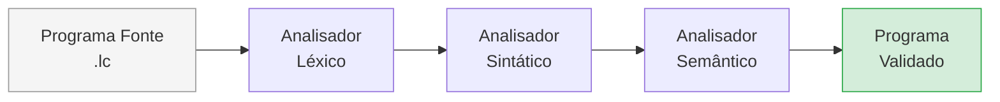
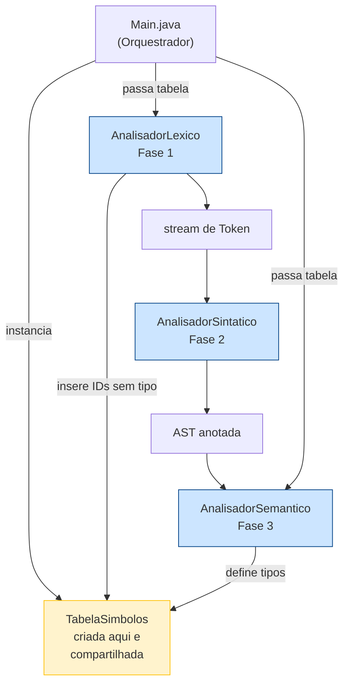
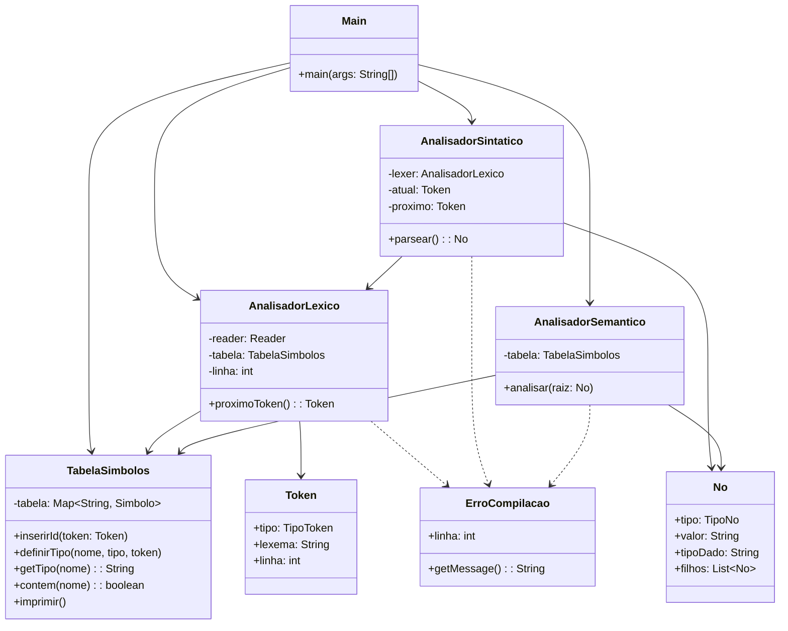
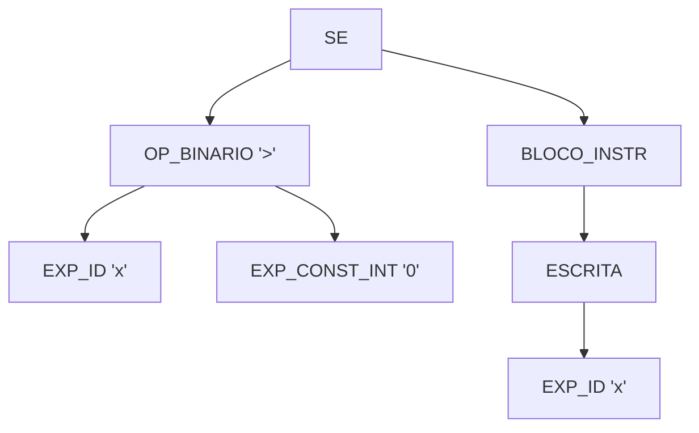
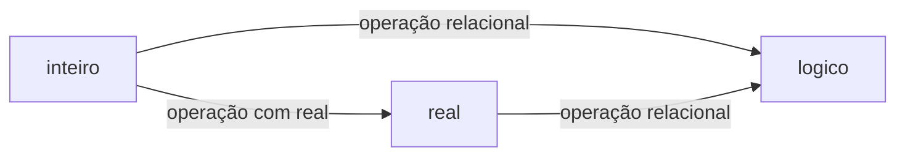

# Compilador BRL — Documentação

**Disciplina:** Compiladores  
**Instituição:** Dom Helder
**Professor:** Prof. Dr. Marcos W. Rodrigues  
**Autores:** Giovanna Penido · João Victor Lisboa · Daniel Nunes  

---

## Sumário

1. [Visão Geral](#1-visão-geral)
2. [Como Usar](#2-como-usar)
3. [A Linguagem BRL](#3-a-linguagem-brl)
4. [Arquitetura do Compilador](#4-arquitetura-do-compilador)
5. [Fase 1 — Analisador Léxico](#5-fase-1--analisador-léxico)
6. [Fase 2 — Analisador Sintático](#6-fase-2--analisador-sintático)
7. [Fase 3 — Analisador Semântico](#7-fase-3--analisador-semântico)
8. [Mensagens de Erro](#8-mensagens-de-erro)
9. [Exemplos](#9-exemplos)
10. [Arquivos de Teste](#10-arquivos-de-teste)
11. [Estrutura dos Arquivos](#11-estrutura-dos-arquivos)

---

## 1. Visão Geral

O compilador BRL realiza a análise completa de programas escritos na linguagem fonte **BRL** (arquivos `.lc`), cobrindo as três primeiras fases de um compilador:



Ao final da análise, o compilador exibe a **tabela de símbolos** com todos os identificadores encontrados e seus tipos, ou interrompe com uma **mensagem de erro** indicando a linha do problema.

---

## 2. Como Usar

### Compilar o compilador (Java)

```bash
javac -d out/production/Compilador src/*.java
```

### Executar

```bash
java -cp out/production/Compilador BRL <arquivo.lc> <saida.asm>
```

**Parâmetros:**
| # | Parâmetro | Descrição |
|---|-----------|-----------|
| 1 | `arquivo.lc` | Caminho completo para o programa fonte BRL |
| 2 | `saida.asm` | Caminho completo para o arquivo Assembly a ser gerado (fase futura) |

### Saída esperada (sucesso)

```
Analise concluida com sucesso: programa.lc

=== TABELA DE SIMBOLOS ===
meuPrograma                    | programa
x                              | inteiro
nome                           | caractere
flag                           | logico
pi                             | real
```

> O nome do programa aparece na tabela com tipo `programa`, pois é o primeiro identificador encontrado pelo léxico.

### Saída esperada (erro)

```
Erro na linha 6: Variável 'z' não declarada
```

---

## 3. A Linguagem BRL

### 3.1 Tipos de Dados

| Tipo | Tamanho | Intervalo |
|------|---------|-----------|
| `inteiro` | 4 bytes | -2³¹ a 2³¹-1 |
| `real` | 4 bytes | 1.5×10⁻⁴⁵ a 3.4×10³⁸ |
| `logico` | 1 byte | `verdadeiro` / `falso` |
| `caractere` | 512 bytes | até 255 caracteres úteis |

### 3.2 Palavras Reservadas

Conforme a seção 2.4 do enunciado:

```
inteiro   caractere  logico    real
se        entao      senao     enquanto
faca      leitura    escrita   inicio
fim       div        mod       verdadeiro
falso     ou         not       &&
==        =          (         )
<         >          <>        >=
<=        +          -         *
/         ;          :
```

> **Observações sobre o enunciado:**
>
> | # | Seção(ões) | Observação | Decisão adotada |
> |---|-----------|------------|-----------------|
> | 1 | 2.4 × 2.10 | `entao` é utilizado na sintaxe do `se` (seção 2.10) mas não constava na lista de palavras reservadas (seção 2.4). Provável omissão do enunciado. | Adicionado como palavra reservada — consta na tabela acima |
> | 2 | 2.11 | A seção 2.11 define como regra **léxica** que constantes numéricas podem ter `+`/`-` antes dos dígitos (`+5`, `-3`). Como `+` e `-` também são operadores binários, a ambiguidade é resolvida tratando o sinal como operador **unário** no analisador sintático (`expUnaria`). | Sinal tratado pelo analisador sintático, não pelo léxico |
> | 3 | 2.4 × 2.6 | A seção 2.6 utiliza `not` para negação lógica, mas `not` não consta na lista de palavras reservadas da seção 2.4. Provável omissão. | Adicionado como palavra reservada — consta na tabela acima |
> | 4 | 2.4 × 2.10 | A seção 2.4 reserva `leitura` e `escrita`, mas a seção 2.10 usa `leia` e `escreva` na sintaxe dos comandos. | Aceitos os quatro: `leitura`/`leia` e `escrita`/`escreva` mapeiam ao mesmo token |
> | 5 | 2.6 | A tabela de precedência da seção 2.6 lista `*`, `&&`, `/`, `div` no nível 3 (multiplicativo), mas omite `mod`. | `mod` tratado como operador multiplicativo (nível 3), junto com `div` |

### 3.3 Operadores

| Categoria | Operadores |
|-----------|-----------|
| Relacionais | `==` `<>` `<` `>` `<=` `>=` |
| Aditivos | `+` `-` `ou` |
| Multiplicativos | `*` `/` `div` `mod` `&&` |
| Unário lógico | `not` |
| Atribuição | `:=` |

**Precedência** (maior para menor), conforme seção 2.6 do enunciado:
1. `()` — parênteses
2. `not`, `+` unário, `-` unário
3. `*` `/` `div` `mod` `&&`
4. `+` `-` `ou`
5. `==` `<>` `<` `>` `<=` `>=`

### 3.4 Comentários

```
/* Este é um comentário
   que pode ter múltiplas linhas */
```

### 3.5 Estrutura do Programa

```
inicio <nome_programa> ;
  <declarações>
  <instruções>
fim
```

### 3.6 Declarações de Variáveis

```
<id> [, <id>]* : <tipo> ;
```

Exemplos:
```
x, y, z : inteiro ;
nome     : caractere ;
ativo    : logico ;
taxa     : real ;
```

### 3.7 Instruções

#### Atribuição
```
<id> := <expressão> ;
```

#### Condicional
```
se <condição> entao inicio
  <instruções>
fim

se <condição> entao inicio
  <instruções>
fim senao inicio
  <instruções>
fim
```

#### Repetição
```
enquanto <condição> faca inicio
  <instruções>
fim
```

#### Entrada / Saída
```
leitura(<id> [, <id>]*) ;
escrita(<expressão>) ;
```

---

## 4. Arquitetura do Compilador

### Fluxo entre componentes



### Responsabilidades das classes



---

## 5. Fase 1 — Analisador Léxico

### Funcionamento

O analisador léxico (`AnalisadorLexico.java`) lê o arquivo fonte caractere a caractere e agrupa em **tokens**. Além de produzir tokens, recebe uma referência à `TabelaSimbolos` e **registra cada identificador novo** assim que o encontra, com tipo ainda indefinido.

### Tokens Reconhecidos

| Token | Padrão |
|-------|--------|
| `ID` | `[a-zA-Z_][a-zA-Z0-9_]*` (máx. 512 chars) |
| `CONST_INT` | `[0-9]+` |
| `CONST_REAL` | `[0-9]+\.[0-9]+` |
| `CONST_STR` | `"[^"\n]*"` |
| Palavras reservadas | `inteiro`, `real`, `logico`, `se`, `entao`, etc. |
| Operadores multi-char | `:=`, `==`, `<>`, `<=`, `>=`, `&&` |
| Delimitadores | `;` `:` `,` `(` `)` `[` `]` `{` `}` |

### Erros Léxicos Detectados

| Situação | Mensagem emitida |
|----------|-----------------|
| Caractere inválido | `Símbolo inválido: '<char>'` |
| Caractere permitido fora de string (`'` `\` `\|` `!` `?`) | `Símbolo '<char>' válido apenas dentro de strings` |
| String não fechada (quebra de linha) | `String não fechada antes da quebra de linha` |
| String não fechada (EOF) | `String não fechada antes do fim do arquivo` |
| Real malformado (`3.`) | `Número real malformado: '3.' (faltam dígitos após o ponto)` |
| Comentário não fechado | `Comentário não fechado (falta */)` |
| Identificador muito longo | `Identificador excede o limite de 512 caracteres` |
| `&` isolado | `Símbolo inválido: '&' (use '&&' para E lógico)` |

---

## 6. Fase 2 — Analisador Sintático

### Funcionamento

O parser (`AnalisadorSintatico.java`) implementa um **parser recursivo descendente** com **2 tokens de lookahead**, necessário para distinguir declarações de atribuições (ambas começam com `ID`, mas declarações têm `:` ou `,` a seguir, enquanto atribuições têm `:=`).

### Gramática BNF

```bnf
programa     ::= 'inicio' ID ';' bloco_decl bloco_instr 'fim'
bloco_decl   ::= (declaracao)*
declaracao   ::= ID (',' ID)* ':' tipo ';'
tipo         ::= 'inteiro' | 'real' | 'logico' | 'caractere'
bloco_instr  ::= (instrucao)*
instrucao    ::= atrib | cmd_se | cmd_enquanto | cmd_leitura | cmd_escrita
atrib        ::= ID ':=' expressao ';'
cmd_se       ::= 'se' exp 'entao' 'inicio' bloco_instr 'fim'
                 ('senao' 'inicio' bloco_instr 'fim')?
cmd_enquanto ::= 'enquanto' exp 'faca' 'inicio' bloco_instr 'fim'
cmd_leitura  ::= 'leitura' '(' ID (',' ID)* ')' ';'
cmd_escrita  ::= 'escrita' '(' exp ')' ';'
exp          ::= expRel
expRel       ::= expAdit (RELOP expAdit)?
expAdit      ::= expMult (('+' | '-' | 'ou') expMult)*
expMult      ::= expUnaria (('*'|'/'|'div'|'mod'|'&&') expUnaria)*
expUnaria    ::= 'not' expUnaria | ('+' | '-') expUnaria | expPrimaria
expPrimaria  ::= ID | CONST_INT | CONST_REAL | CONST_STR
               | 'verdadeiro' | 'falso' | '(' exp ')'
```

### Exemplo de AST

Para o trecho `se x > 0 entao inicio escrita(x) ; fim`:



### Tipos de Nó da AST

| Nó | Filhos |
|----|--------|
| `PROGRAMA` | `[BLOCO_DECL, BLOCO_INSTR]` — valor = nome do programa |
| `BLOCO_DECL` | lista de `DECLARACAO` |
| `DECLARACAO` | `[EXP_ID..., DECLARACAO(tipo)]` — último filho carrega o tipo |
| `BLOCO_INSTR` | lista de instruções |
| `ATRIB` | `[EXP_ID, expressao]` |
| `SE` | `[cond, bloco_then]` ou `[cond, bloco_then, bloco_senao]` |
| `ENQUANTO` | `[cond, corpo]` |
| `LEITURA` | `[EXP_ID, ...]` |
| `ESCRITA` | `[expressao]` |
| `OP_BINARIO(op)` | `[esq, dir]` — valor = operador (`+`, `==`, `&&`, etc.) |
| `OP_UNARIO(op)` | `[operando]` — valor = operador (`not`, `+` ou `-`) |

---

## 7. Fase 3 — Analisador Semântico

### Funcionamento

O analisador semântico (`AnalisadorSemantico.java`) percorre a AST em duas etapas:

1. **Definição de tipos** — para cada declaração, chama `TabelaSimbolos.definirTipo()`, preenchendo o tipo dos identificadores que o léxico havia inserido sem tipo. O nome do programa recebe o tipo especial `"programa"`.
2. **Verificação de instruções e expressões** — infere e verifica tipos, anotando cada nó com seu `tipoDado`.

### Regras de Tipo

| Operação | Regra |
|----------|-------|
| Atribuição | Tipo da variável deve ser compatível com o tipo da expressão |
| Condição `se` / `enquanto` | Expressão deve ser do tipo `logico` |
| `ou`, `&&`, `not` | Operandos devem ser `logico` |
| `+`, `-`, `*`, `/` | Operandos devem ser `inteiro` ou `real` |
| `div`, `mod` | Operandos devem ser `inteiro` |
| `+` entre `caractere` | Concatenação de strings |
| Relacionais | Operandos do mesmo tipo (ou `inteiro`/`real` misturados) |

### Promoção de Tipos



---

## 8. Mensagens de Erro

Todos os erros seguem o formato:

```
Erro na linha <N>: <descrição>
```

### Erros Léxicos

| Situação | Exemplo de mensagem |
|----------|---------------------|
| Caractere inválido | `Erro na linha 9: Símbolo inválido: '@'` |
| String não fechada | `Erro na linha 5: String não fechada antes da quebra de linha` |
| Real malformado | `Erro na linha 7: Número real malformado: '3.' (faltam dígitos após o ponto)` |
| Comentário não fechado | `Erro na linha 2: Comentário não fechado (falta */)` |
| `&` isolado | `Erro na linha 4: Símbolo inválido: '&' (use '&&' para E lógico)` |

### Erros Sintáticos

| Situação | Exemplo de mensagem |
|----------|---------------------|
| Token inesperado | `Erro na linha 10: Esperado 'PONTO_VIRGULA' mas encontrado 'escrita'` |
| Tipo inválido | `Erro na linha 2: Tipo inválido: 'numero'` |
| Expressão inválida | `Erro na linha 8: Expressão inválida: ';'` |
| Instrução inválida | `Erro na linha 6: Instrução inválida: 'inteiro'` |

### Erros Semânticos

| Situação | Exemplo de mensagem |
|----------|---------------------|
| Variável não declarada | `Erro na linha 6: Variável 'z' não declarada` |
| Variável redeclarada | `Erro na linha 3: Variável 'x' já foi declarada` |
| Tipo incompatível | `Erro na linha 9: Tipo incompatível: variável 'x' é inteiro mas expressão é caractere` |
| Condição do SE não lógica | `Erro na linha 12: Condição do SE deve ser lógica, mas é inteiro` |
| Condição do ENQUANTO não lógica | `Erro na linha 8: Condição do ENQUANTO deve ser lógica, mas é real` |
| Operador lógico com tipo errado | `Erro na linha 5: Operador 'not' requer operando lógico, mas é inteiro` |
| Operador unário aritmético com tipo errado | `Erro na linha 5: Operador unário '-' requer operando numérico, mas é lógico` |

---

## 9. Exemplos

### Programa Mínimo

```
inicio vazio ;
fim
```

### Fatorial

```
/* Calcula fatorial de n */
inicio fatorial ;
  n, resultado, i : inteiro ;

  leitura(n) ;
  resultado := 1 ;
  i := 1 ;

  enquanto i <= n faca inicio
    resultado := resultado * i ;
    i := i + 1 ;
  fim

  escrita(resultado) ;
fim
```

### Verificação Lógica com Tipos Mistos

```
inicio logica ;
  a, b : logico ;
  x    : inteiro ;
  taxa : real ;

  x    := 5 ;
  taxa := 2.5 ;
  a    := x > 3 ;        /* inteiro relacional → logico */
  b    := taxa < 10.0 ;  /* real relacional    → logico */

  se a && b entao inicio
    escrita(x) ;
  fim senao inicio
    escrita(taxa) ;
  fim
fim
```

---

## 10. Arquivos de Teste

| Arquivo | Propósito | Resultado esperado |
|---------|-----------|-------------------|
| `teste.lc` | Programa válido completo — todos os tipos, operadores, estruturas e comandos | `Analise concluida com sucesso` + tabela de símbolos |
| `teste_erro_lexico.lc` | Contém `@`, caractere inválido | `Erro na linha 9: Símbolo inválido: '@'` |
| `teste_erro_sintatico.lc` | Atribuição sem `;` | `Erro na linha 10: Esperado 'PONTO_VIRGULA' mas encontrado 'escrita'` |
| `teste_erro_semantico.lc` | Atribuição de `caractere` em variável `inteiro` | `Erro na linha 13: Tipo incompatível: variável 'contador' é inteiro mas expressão é caractere` |

---

## 11. Estrutura dos Arquivos

```
Compilador-BRL/
├── src/
│   ├── BRL.java                  # Ponto de entrada (classe BRL): cria TabelaSimbolos e executa as 3 fases
│   ├── ErroCompilacao.java       # Exceção com mensagem e número de linha
│   ├── TipoToken.java            # Enum de todos os tipos de token
│   ├── Token.java                # Token com tipo, lexema e linha
│   ├── TabelaSimbolos.java       # Compartilhada: IDs inseridos pelo léxico, tipos pelo semântico
│   ├── AnalisadorLexico.java     # Fase 1: tokenizador + inserção de IDs na tabela
│   ├── TipoNo.java               # Enum de tipos de nó da AST
│   ├── No.java                   # Nó da AST (tipo, valor, tipoDado, filhos)
│   ├── AnalisadorSintatico.java  # Fase 2: parser recursivo descendente com 2-token lookahead
│   └── AnalisadorSemantico.java  # Fase 3: inferência de tipos e validação semântica
├── teste.lc                      # Programa válido e completo
├── teste_erro_lexico.lc          # Erro léxico: caractere inválido '@'
├── teste_erro_sintatico.lc       # Erro sintático: ';' ausente
├── teste_erro_semantico.lc       # Erro semântico: tipo incompatível
├── ER.txt                        # Expressões regulares da linguagem
└── DOCUMENTACAO.md               # Este arquivo
```
